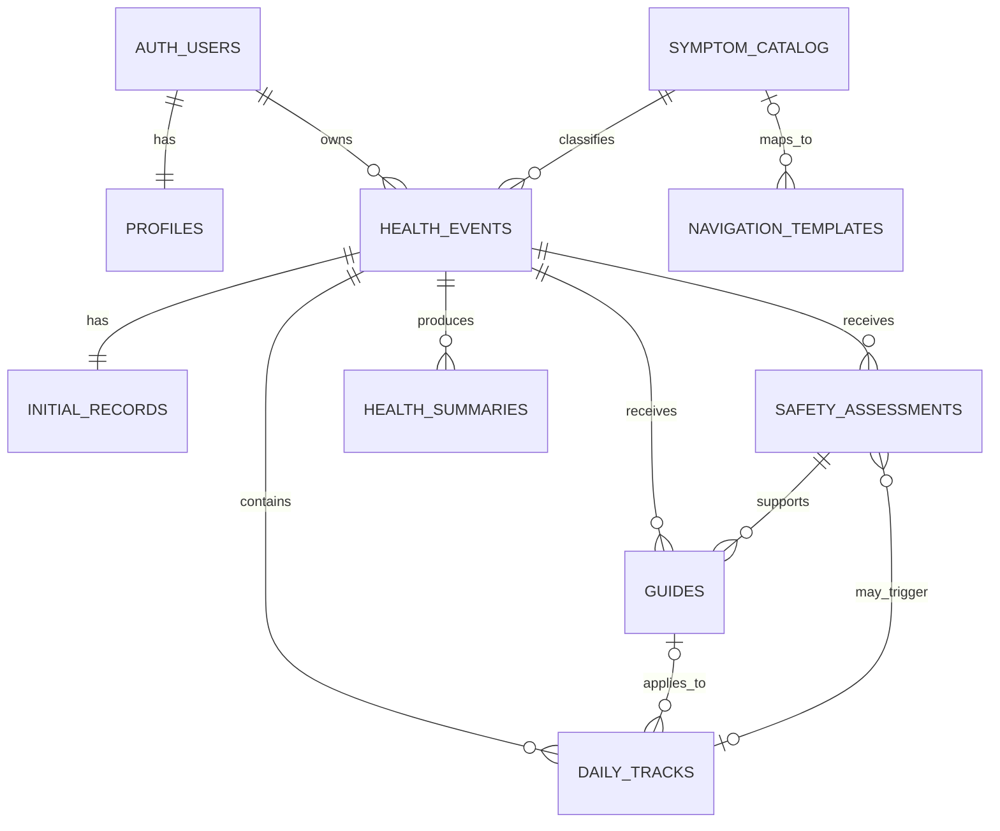

# NexNav MVP — Database Schema & Supabase Architecture

**Version:** v1.0  
**Status:** Locked for Day 2 MVP Development  
**Product:** NexNav  
**Database:** Supabase PostgreSQL  
**Source of Truth:** `01_Project_Vision.md v1.2` + `02_PRD.md v1.0`  
**Supporting Flow:** `User_Flow.md v1.0`  
**Scope:** P0 Golden Path; P1/P2 only as explicit extension boundaries  
**SQL Status:** This document defines the implementation contract; executable migration SQL is deferred to implementation.

---

## 1. Document Purpose

This document defines the NexNav P0 data model, table responsibilities, field-level draft, relationships, lifecycle rules, constraints, indexes, Row Level Security (RLS), seed-data boundaries, derived logic, and transactional operations.

The schema supports:

**Account/Profile → Record → Safety Check → Guide → Act → Track → Reassess → Navigate → Prepare**

NexNav is a health-navigation and tracking product, not a diagnostic system. The database must preserve user ownership, historical stability, conservative Safety routing, and immutable ready-summary snapshots.

When `01_Project_Vision.md v1.2` and `02_PRD.md v1.0` differ in MVP implementation detail, the locked PRD governs implementation. Project Vision governs product direction.

---

## 2. Architecture Principles

1. Supabase Auth owns authentication; application tables do not duplicate credential data.
2. Every user-owned record is isolated by RLS.
3. Health Event closure is a status transition, not deletion.
4. Initial Record edits preserve Event start date and historical child records.
5. Safety Assessments and Guides are version-aware history, not overwrite-only fields.
6. Daily Tracks preserve the applicable Guide/Suggestion snapshot.
7. Reassess, Timeline, Current Safety, Current Guide, and Summary freshness are derived rather than stored as redundant truth.
8. Ready Health Summaries are immutable snapshots.
9. `Other` never causes guessed diagnoses, causes, or specialty mappings.
10. Data integrity and isolation take priority over frontend convenience.
11. The P0 schema remains small enough for a 10-day Lovable + Supabase workflow.

---

## 3. Table Inventory

### 3.1 Supabase-managed table

| Table | Responsibility |
|---|---|
| `auth.users` | Email/Google identity, credentials, sessions, and provider metadata |

### 3.2 NexNav P0 tables

| # | Table | Type | User-owned |
|---:|---|---|---:|
| 1 | `profiles` | User profile and optional health background | Yes |
| 2 | `symptom_catalog` | Shared symptom reference data | No |
| 3 | `health_events` | One health-concern tracking lifecycle | Yes |
| 4 | `initial_records` | Editable Event baseline | Yes |
| 5 | `safety_assessments` | Safety Check/Recheck history | Yes |
| 6 | `guides` | Versioned Guide snapshots | Yes |
| 7 | `daily_tracks` | One Track per Event per local calendar day | Yes |
| 8 | `navigation_templates` | Shared curated navigation content | No |
| 9 | `health_summaries` | Draft and ready summary snapshots | Yes |

### 3.3 Concepts intentionally not modeled as tables

| Concept | Decision |
|---|---|
| Act | Product-loop stage, not a task/habit entity |
| Reassess / Trend | Derived from Initial Record and latest valid Track |
| Timeline | Composed from stored Event history |
| Life Context | Embedded snapshot in Initial Record and Daily Track |
| Associated Symptoms | Embedded array in Initial Record |
| Guide Suggestions | Embedded in versioned Guide snapshot |
| Suggestion Execution | Embedded in Daily Track snapshot |
| Navigation Result | Selected from current context; P0 does not persist view history |
| Connect / Appointment | P1 only; no P0 dependency |
| Product Feedback | P1 only |
| Community / Experience Sharing | P2 mock boundary under locked PRD |
| Wearables / Health Reports | P2 UI prototype only |

---

## 4. Relationship and Cardinality Map



### 4.1 Cardinality rules

| Parent | Child | Cardinality | Rule |
|---|---|---|---|
| `auth.users` | `profiles` | 1:1 | Empty Profile is created automatically on first Auth User creation |
| `auth.users` | `health_events` | 1:N | Multiple active Events are allowed |
| `symptom_catalog` | `health_events` | 1:N | One Primary Symptom per Event |
| `health_events` | `initial_records` | 1:1 | Exactly one editable baseline per Event |
| `health_events` | `safety_assessments` | 1:N | Every attempt is retained |
| `health_events` | `guides` | 1:N | Refresh creates a new version |
| `health_events` | `daily_tracks` | 1:N | Maximum one Track per Event per day |
| `health_events` | `health_summaries` | 1:N | Multiple ready snapshots are allowed |
| `guides` | `daily_tracks` | 1:N optional | Priority route may Track without a Guide |
| `daily_tracks` | `safety_assessments` | 1:N optional | Retry attempts may create multiple Assessments |
| `symptom_catalog` | `navigation_templates` | 1:N optional | Generic fallback may have no symptom |

---

## 5. Common Data-Type Standards

| Purpose | PostgreSQL type | Standard |
|---|---|---|
| Primary/foreign key | `uuid` | Primary keys default to `gen_random_uuid()` unless shared with Auth ID |
| Short or long text | `text` | Length guarded where useful |
| Small numeric rating | `smallint` | Range constrained |
| Version/order/count | `integer` | Non-negative or positive constraint as appropriate |
| Local calendar date | `date` | Used for `started_on` and `track_date` |
| Exact timestamp | `timestamptz` | Default `now()` where appropriate |
| Boolean flag | `boolean` | Explicit default |
| Structured snapshot | `jsonb` | Object/array shape validated at minimum |

Logical enums use `text + CHECK` rather than PostgreSQL enum types, allowing safer iteration during the MVP while preventing invalid values.

All exact timestamps use `timestamptz`. Daily Track date logic uses the `Asia/Taipei` local calendar for P0.

---

## 6. Logical Enums

| Domain | Allowed values |
|---|---|
| Event status | `active`, `closed` |
| Gender | `male`, `female`, `non_binary`, `other`, `prefer_not_to_say` |
| Safety trigger | `event_created`, `initial_record_updated`, `daily_track_recheck`, `manual_retry` |
| Assessment status | `in_progress`, `completed`, `failed` |
| Safety result | `normal`, `attention`, `priority_care` |
| Subjective change | `much_better`, `slightly_better`, `no_clear_change`, `slightly_worse`, `much_worse` |
| Duration unit | `minutes`, `hours`, `days`, `weeks`, `months` |
| Navigation type | `medical_care`, `professional_support` |
| Navigation safety context | `general`, `attention`, `priority_care`, `fallback` |
| Summary type | `medical`, `professional_support` |
| Summary status | `draft`, `ready` |

Safety result values are internal routing states. User-facing UI must use natural-language copy.

---

## 7. Field-Level Schema

### 7.1 `profiles`

**Responsibility:** One private application profile per Auth User. An empty row is created at signup/first OAuth login; onboarding completion controls access to core product routes.

| Column | Type | Null | Default / constraint |
|---|---|---:|---|
| `id` | `uuid` | No | PK; FK → `auth.users.id`; `ON DELETE CASCADE` |
| `display_name` | `text` | Yes | 1–50 characters when present; required when onboarding completes |
| `birth_year` | `smallint` | Yes | Required when onboarding completes; broad database sanity range |
| `gender` | `text` | Yes | Gender logical enum; required when onboarding completes |
| `health_background` | `jsonb` | No | Default `{}`; must be a JSON object |
| `onboarding_completed` | `boolean` | No | Default `false` |
| `onboarding_completed_at` | `timestamptz` | Yes | Required iff onboarding is complete |
| `created_at` | `timestamptz` | No | Default `now()` |
| `updated_at` | `timestamptz` | No | Default `now()`; maintained on update |

Suggested `health_background` shape:

```json
{
  "chronic_conditions": [],
  "allergies": [],
  "medications": [],
  "other_notes": ""
}
```

Birth-year clarification:

- Target user age 18–55 is positioning, not a hard database exclusion of older adults.
- UI recommendation for 2026 is a dynamic 18–70 range: current year − 70 through current year − 18, which equals 1956–2008 in 2026.
- The database retains a broader sanity range so future scope changes do not require data-model redesign.
- Email is not duplicated here; Supabase Auth owns it.

### 7.2 `symptom_catalog`

**Responsibility:** Shared read-only catalog for 5 categories, 7 supported Primary Symptoms, and `Other`.

| Column | Type | Null | Default / constraint |
|---|---|---:|---|
| `id` | `uuid` | No | PK; default UUID |
| `code` | `text` | No | Unique; lowercase letters, digits, underscores |
| `category_code` | `text` | No | 1–50 characters |
| `category_name` | `text` | No | 1–50 characters |
| `display_name` | `text` | No | 1–100 characters |
| `description` | `text` | Yes | Recommended maximum 500 characters |
| `is_primary_enabled` | `boolean` | No | Default `true` |
| `is_hero_group` | `boolean` | No | Default `false` |
| `is_other` | `boolean` | No | Default `false` |
| `is_active` | `boolean` | No | Default `true` |
| `display_order` | `integer` | No | ≥ 0 |
| `created_at` | `timestamptz` | No | Default `now()` |
| `updated_at` | `timestamptz` | No | Default `now()` |

Historical catalog rows are deactivated, not deleted. Exactly one active `Other` row is allowed.

### 7.3 `health_events`

**Responsibility:** One complete user-facing 狀況追蹤 lifecycle.

| Column | Type | Null | Default / constraint |
|---|---|---:|---|
| `id` | `uuid` | No | PK; default UUID |
| `user_id` | `uuid` | No | FK → `auth.users.id`; `ON DELETE CASCADE` |
| `primary_symptom_id` | `uuid` | No | FK → `symptom_catalog.id`; `ON DELETE RESTRICT` |
| `custom_primary_symptom` | `text` | Yes | 1–100 characters; required only for `Other` |
| `status` | `text` | No | Event enum; default `active` |
| `started_on` | `date` | No | Original local start date; immutable |
| `closed_at` | `timestamptz` | Yes | Null for active; required for closed |
| `created_at` | `timestamptz` | No | Default `now()` |
| `updated_at` | `timestamptz` | No | Default `now()` |

Immutable after creation: `user_id`, `primary_symptom_id`, `custom_primary_symptom`, `started_on`, and `created_at`. If the Primary Symptom or `Other` description is wrong, close the Event and create a new one.

### 7.4 `initial_records`

**Responsibility:** The editable baseline for one Health Event.

| Column | Type | Null | Default / constraint |
|---|---|---:|---|
| `id` | `uuid` | No | PK; default UUID |
| `user_id` | `uuid` | No | FK → `auth.users.id`; owner must match Event |
| `health_event_id` | `uuid` | No | FK → `health_events.id`; `ON DELETE CASCADE`; unique |
| `severity` | `smallint` | No | 1–10 |
| `frequency_level` | `smallint` | No | 1–5 |
| `frequency_description` | `text` | Yes | Recommended maximum 200 characters |
| `duration_value` | `integer` | No | > 0 |
| `duration_unit` | `text` | No | Duration logical enum |
| `associated_symptoms` | `jsonb` | No | Default `[]`; must be an array |
| `life_context` | `jsonb` | No | Must be an object containing sleep, diet, activity, stress |
| `supplemental_description` | `text` | Yes | Recommended maximum 1,000 characters |
| `revision` | `integer` | No | Default 1; > 0; increments on relevant content change |
| `created_at` | `timestamptz` | No | Default `now()` |
| `updated_at` | `timestamptz` | No | Default `now()` |

Suggested Associated Symptoms shape:

```json
[
  { "symptom_id": "uuid", "custom_text": null }
]
```

Minimum Life Context shape:

```json
{
  "sleep": {},
  "diet": {},
  "activity": {},
  "stress": {}
}
```

Frequency scale:

| Value | Display concept |
|---:|---|
| 1 | Occasional / very infrequent |
| 2 | Intermittent |
| 3 | About once daily |
| 4 | Multiple times daily |
| 5 | Almost continuous / very frequent |

This is a record-comparison scale, not a medical score.

### 7.5 `safety_assessments`

**Responsibility:** Immutable history of each completed or failed Safety Check/Recheck attempt.

| Column | Type | Null | Default / constraint |
|---|---|---:|---|
| `id` | `uuid` | No | PK; default UUID |
| `user_id` | `uuid` | No | FK → `auth.users.id`; owner must match Event |
| `health_event_id` | `uuid` | No | FK → `health_events.id`; `ON DELETE CASCADE` |
| `source_daily_track_id` | `uuid` | Yes | FK → `daily_tracks.id`; `ON DELETE SET NULL` |
| `trigger_type` | `text` | No | Safety-trigger logical enum |
| `record_revision` | `integer` | No | > 0; Initial Record revision used |
| `assessment_status` | `text` | No | Assessment-status enum; default `in_progress` |
| `answers_snapshot` | `jsonb` | No | JSON object/array; stores questions and answers |
| `result` | `text` | Yes | Safety-result enum; required only when completed |
| `rule_version` | `text` | No | Example: `mock_v1` |
| `failure_reason` | `text` | Yes | Required when failed; recommended maximum 1,000 characters |
| `resolved_at` | `timestamptz` | Yes | Required when completed or failed |
| `created_at` | `timestamptz` | No | Default `now()` |

Allowed terminal transitions: `in_progress → completed` or `in_progress → failed`. Completed/failed rows are immutable. Retry creates a new row. P0 may directly create terminal rows because its rule evaluation is immediate.

### 7.6 `guides`

**Responsibility:** Immutable versioned Guide output for one Event and Initial Record revision.

| Column | Type | Null | Default / constraint |
|---|---|---:|---|
| `id` | `uuid` | No | PK; default UUID |
| `user_id` | `uuid` | No | FK → `auth.users.id`; owner must match Event |
| `health_event_id` | `uuid` | No | FK → `health_events.id`; `ON DELETE CASCADE` |
| `safety_assessment_id` | `uuid` | No | FK → `safety_assessments.id`; `ON DELETE RESTRICT` |
| `record_revision` | `integer` | No | > 0 |
| `version_number` | `integer` | No | > 0; unique within Event |
| `content_snapshot` | `jsonb` | No | Must be an object |
| `suggestions_snapshot` | `jsonb` | No | Array of 2–3 suggestions |
| `template_code` | `text` | No | 1–100 characters |
| `template_version` | `text` | No | 1–50 characters |
| `created_at` | `timestamptz` | No | Default `now()` |

Minimum content shape:

```json
{
  "health_context_summary": "",
  "general_information": "",
  "possible_factors": [],
  "observation_guidance": "",
  "sources": []
}
```

Suggestion shape:

```json
[
  {
    "id": "stable_suggestion_key",
    "title": "",
    "description": ""
  }
]
```

Guide rows are insert-only snapshots. Content changes create a new version.

### 7.7 `daily_tracks`

**Responsibility:** One daily health observation per Event per Asia/Taipei calendar date.

| Column | Type | Null | Default / constraint |
|---|---|---:|---|
| `id` | `uuid` | No | PK; default UUID |
| `user_id` | `uuid` | No | FK → `auth.users.id`; owner must match Event |
| `health_event_id` | `uuid` | No | FK → `health_events.id`; `ON DELETE CASCADE` |
| `guide_id` | `uuid` | Yes | FK → `guides.id`; `ON DELETE SET NULL`; same Event when present |
| `track_date` | `date` | No | Asia/Taipei local date; immutable |
| `severity` | `smallint` | No | 1–10 |
| `frequency_level` | `smallint` | No | 1–5 |
| `frequency_description` | `text` | Yes | Recommended maximum 200 characters |
| `subjective_change` | `text` | No | Subjective-change logical enum |
| `life_context` | `jsonb` | No | Object containing four required context keys |
| `suggestion_execution` | `jsonb` | No | Default `[]`; must be an array |
| `notes` | `text` | Yes | Recommended maximum 1,000 characters |
| `created_at` | `timestamptz` | No | Default `now()` |
| `updated_at` | `timestamptz` | No | Default `now()` |

Suggestion-execution shape:

```json
[
  {
    "suggestion_id": "stable_suggestion_key",
    "title_snapshot": "",
    "executed": true
  }
]
```

Today may be edited; historical rows are read-only in P0. After first creation, `guide_id`, suggestion IDs, and title snapshots remain fixed. An active Priority Care Event may Track without a Guide.

### 7.8 `navigation_templates`

**Responsibility:** Shared curated Medical Care and Professional Support directions.

| Column | Type | Null | Default / constraint |
|---|---|---:|---|
| `id` | `uuid` | No | PK; default UUID |
| `code` | `text` | No | Stable template family code |
| `symptom_id` | `uuid` | Yes | FK → `symptom_catalog.id`; `ON DELETE RESTRICT`; null for generic fallback |
| `navigation_type` | `text` | No | Navigation-type enum |
| `safety_context` | `text` | No | Navigation-safety-context enum |
| `title` | `text` | No | 1–200 characters |
| `content` | `jsonb` | No | Must be an object |
| `sources` | `jsonb` | No | Default `[]`; must be an array |
| `is_fallback` | `boolean` | No | Default `false` |
| `is_active` | `boolean` | No | Default `true` |
| `version` | `integer` | No | > 0 |
| `created_at` | `timestamptz` | No | Default `now()` |
| `updated_at` | `timestamptz` | No | Default `now()` |

Medical Care templates require non-empty trusted sources. `priority_care` templates must use `medical_care`. `Other` and missing mappings use a general medical-evaluation fallback.

### 7.9 `health_summaries`

**Responsibility:** A complete summary snapshot bound to one Event.

| Column | Type | Null | Default / constraint |
|---|---|---:|---|
| `id` | `uuid` | No | PK; default UUID |
| `user_id` | `uuid` | No | FK → `auth.users.id`; owner must match Event |
| `health_event_id` | `uuid` | No | FK → `health_events.id`; `ON DELETE CASCADE` |
| `summary_type` | `text` | No | Summary-type logical enum |
| `status` | `text` | No | Summary-status enum; default `draft` |
| `snapshot_content` | `jsonb` | No | Must be an object |
| `source_record_revision` | `integer` | No | > 0 |
| `latest_track_date` | `date` | Yes | Null for an initial-record-only summary |
| `source_data_updated_at` | `timestamptz` | No | Source-data cutoff timestamp |
| `confirmed_at` | `timestamptz` | Yes | Required when ready |
| `created_at` | `timestamptz` | No | Default `now()` |
| `updated_at` | `timestamptz` | No | Default `now()`; draft only |

Minimum snapshot shape:

```json
{
  "main_condition": {},
  "tracking_change": {},
  "context_and_notes": {},
  "life_context": {},
  "actions_tried": [],
  "selected_health_background": {},
  "selected_track_notes": [],
  "questions_for_professional": [],
  "disclaimer": ""
}
```

`questions_for_professional` allows 0–3 items. A draft may be regenerated before confirmation. Once `ready`, content, type, and source metadata are immutable; a newer summary is a new row.

---

## 8. Unique Constraints and Indexes

### 8.1 Unique constraints

| Table | Constraint | Purpose |
|---|---|---|
| `profiles` | PK `id` | One Profile per Auth User |
| `symptom_catalog` | Unique `code` | Stable content key |
| `symptom_catalog` | Partial unique active `is_other = true` | One active Other option |
| `health_events` | Unique `(id, user_id)` | Composite ownership reference target |
| `initial_records` | Unique `health_event_id` | One Initial Record per Event |
| `guides` | Unique `(health_event_id, version_number)` | Unique Event-local Guide version |
| `daily_tracks` | Unique `(health_event_id, track_date)` | One Track per Event per day |
| `navigation_templates` | Unique `(code, version)` | Preserve template history |
| `navigation_templates` | Partial unique `code` where active | One active version per template family |
| `health_summaries` | Partial unique `(health_event_id, summary_type)` where draft | Maximum one working draft of each type |

All private child tables use `(health_event_id, user_id) → health_events(id, user_id)` ownership consistency, in addition to ordinary foreign keys where needed.

### 8.2 Query indexes

| Table | Index | Supports |
|---|---|---|
| `symptom_catalog` | `(is_active, display_order)` | Ordered active symptom picker |
| `health_events` | `(user_id, updated_at DESC)` where active | Dashboard active cards |
| `health_events` | `(user_id, created_at DESC)` | User Event history |
| `safety_assessments` | `(health_event_id, record_revision, created_at DESC)` where completed | Current valid Safety |
| `safety_assessments` | `(user_id, health_event_id, created_at DESC)` | Event Safety history |
| `safety_assessments` | `source_daily_track_id` where not null | Track-triggered attempts |
| `guides` | `(health_event_id, record_revision, version_number DESC)` | Current Guide |
| `guides` | `(user_id, health_event_id, created_at DESC)` | Guide history |
| `guides` | `safety_assessment_id` | Safety-to-Guide trace |
| `daily_tracks` | Unique `(health_event_id, track_date)` | Timeline, latest Track, count |
| `daily_tracks` | `(user_id, track_date DESC)` | Recent user Tracks |
| `daily_tracks` | `guide_id` where not null | Guide usage trace |
| `navigation_templates` | `(symptom_id, navigation_type, safety_context)` where active | Template selection |
| `navigation_templates` | `(navigation_type, safety_context)` where active and fallback | Safe fallback |
| `health_summaries` | `(health_event_id, created_at DESC)` | Event summary history |
| `health_summaries` | `(user_id, created_at DESC)` | User summary history |
| `health_summaries` | `(health_event_id, confirmed_at DESC)` where ready | Latest ready summary |

No P0 indexes are added for severity, frequency, gender, subjective change, or JSONB contents because P0 does not perform cross-user analytics or free-form health searches.

---

## 9. Data Integrity and Immutability

### 9.1 Ownership integrity

Every private table either directly uses the Auth User ID or inherits ownership through a Health Event. Private child rows store `user_id` for simple RLS and also enforce owner equality with their Event.

Never trust a frontend-supplied owner ID. Controlled operations derive ownership from `auth.uid()`.

### 9.2 Immutable fields and rows

| Entity | Immutable rule |
|---|---|
| Health Event | Owner, Primary Symptom, Other description, start date, creation timestamp |
| Initial Record | Identity, owner, Event relation, creation timestamp; content may update with revision increment |
| Safety Assessment | Immutable after completed/failed |
| Guide | Insert-only immutable version |
| Daily Track | Identity, owner, Event, date, creation timestamp; Guide/Suggestion snapshot fixed after creation |
| Ready Summary | Entire snapshot, type, and source metadata immutable |

### 9.3 State consistency

- `active` Event requires `closed_at IS NULL`.
- `closed` Event requires `closed_at IS NOT NULL`.
- Completed Safety requires result and `resolved_at`, with no failure reason.
- Failed Safety requires failure reason and `resolved_at`, with no result.
- Ready Summary requires `confirmed_at`; draft requires it to be null.
- Closed Event cannot add or update Tracks.
- Historical Track cannot be edited in P0.
- Physical Event, Track, Guide, resolved Safety, and ready-Summary deletion is not exposed in P0.

---

## 10. Row Level Security Design

RLS is enabled on all nine application tables.

### 10.1 Policy matrix

| Table | SELECT | INSERT | UPDATE | DELETE |
|---|---|---|---|---|
| `profiles` | Own row | System trigger | Own row, constrained | Denied |
| `health_events` | Own rows | Own/controlled function | Own/controlled transition | Denied |
| `initial_records` | Own Event | Event creation function | Controlled revision update | Denied |
| `safety_assessments` | Own Event | Controlled assessment operation | Only controlled resolution if used | Denied |
| `guides` | Own Event | Controlled Guide creation | Denied | Denied |
| `daily_tracks` | Own Event | Controlled today-save | Controlled today-save | Denied |
| `health_summaries` | Own Event | Controlled generation | Draft/confirmation operation only | Denied |
| `symptom_catalog` | Authenticated users; active rows | Denied | Denied | Denied |
| `navigation_templates` | Authenticated users; active rows | Denied | Denied | Denied |

Base owner test:

```text
auth.uid() = user_id
```

For `profiles`, the test is `auth.uid() = id`.

Private child writes must additionally prove that the Event owner equals `auth.uid()`. No anonymous access is allowed to profiles, health records, catalogs, templates, or health operations in P0.

### 10.2 Security rules

1. Profile is created automatically after Auth User creation.
2. No user-facing private-data DELETE policies exist in P0.
3. Catalog and navigation data are authenticated read-only.
4. `security definer` is used only where a cross-table atomic operation requires it.
5. Any `security definer` function rechecks `auth.uid()`, fixes a safe `search_path`, and never trusts a passed `user_id`.
6. The Supabase Service Role Key must never appear in Lovable/browser code or a public repository.
7. The frontend uses only the public client key plus authenticated session.

---

## 11. Seed Data and Content Boundaries

### 11.1 Required seed assets

| Asset | Requirement |
|---|---|
| Symptom catalog | 5 categories, 7 Primary Symptoms, and Other |
| Hero groups | Headache/dizziness; fatigue/sleep difficulty; gastrointestinal discomfort |
| Safety | Versioned point-and-click question set and conservative rules |
| Guide templates | Four required layers, 2–3 suggestions, traceable sources |
| Navigation templates | Medical and eligible professional-support directions plus fallbacks |
| Trusted sources | Real, traceable health/public-health sources; never mock authority |

The exact five-category taxonomy, remaining four supported symptoms, Safety questions/rules, Guide copy, source URLs, and specialty mappings remain content-seed deliverables. They are not fabricated or prematurely locked by this schema.

### 11.2 Content behavior

- Three hero groups receive deeper demo content.
- Remaining supported symptoms receive minimum viable trusted content.
- `Other` receives a safe generic Guide and general medical-evaluation fallback.
- Safety conflict priority is `priority_care > attention > normal`.
- Safety execution failure never defaults to `normal`.
- Priority Care Navigation exposes Medical Care only.

---

## 12. Derived Logic

### 12.1 Current Safety

Current Safety is the latest Assessment that:

1. belongs to the Event;
2. is `completed`;
3. has `record_revision` equal to the current Initial Record revision; and
4. contains a valid result.

Derived workflow states:

| Condition | Derived state |
|---|---|
| Valid current completed Assessment | Use its result |
| Only an older revision exists | `recheck_required` |
| Current revision failed with no valid result | `evaluation_failed` |
| No attempt completed yet | `pending` |

These workflow states are not stored Safety result values.

### 12.2 Current Guide

Current Guide is the highest Event-local `version_number` that matches the current Initial Record revision and references a valid Safety Assessment for that revision.

Priority Care does not require a normal Guide and routes primarily to Navigate.

### 12.3 Reassess

Eligibility:

```text
Initial Record + at least 2 Daily Tracks
```

Severity calculation:

```text
severity_delta = latest_track.severity - initial_record.severity
```

| Delta | UI classification |
|---:|---|
| ≤ -2 | `improvement` |
| -1 to +1 | `no_clear_change` |
| ≥ +2 | `worse` |

Frequency is compared separately using latest versus baseline `frequency_level`. No weighted/composite health score is created. Subjective Change remains separate from recorded trend.

Tracking duration uses elapsed Event time through the latest Track date, not Track count. Safety routing always takes priority over Reassess CTA prominence; `worse` does not automatically mean `priority_care`.

### 12.4 Timeline

Timeline is composed from Event creation/closure, Initial Record, Daily Tracks, meaningful Safety results, Guide creation, and Summary creation/confirmation. It is ordered chronologically and does not expose internal technical logs.

### 12.5 Summary freshness

A ready Summary remains unchanged but is not current if any relevant source changes after its source cutoff, including:

- a higher Initial Record revision;
- a newer Daily Track than `latest_track_date`; or
- a relevant source update after `source_data_updated_at`.

An initial-record-only Summary has `latest_track_date = null`; its tracking-change section states insufficient data. A later Track makes that Summary non-current without changing its content or ready status.

### 12.6 Navigation selection

Template selection order:

1. Determine Current Safety.
2. If Priority Care, allow Medical Care only.
3. Try symptom + navigation type + Safety context.
4. Fall back to symptom + general context.
5. Fall back to generic Safety-context content.
6. Finally use general Medical Care fallback.

Associated Symptoms supply context only. `Other` custom text is not parsed to infer disease or specialty.

---

## 13. Transaction and Controlled Operation Rules

### 13.1 Required P0 operations

| Operation | Atomic responsibility |
|---|---|
| `create_health_event` | Validate owner/profile/symptom; create Event + Initial Record together |
| `update_initial_record` | Compare content, update valid fields, increment revision once |
| `save_today_track` | Insert or update the Asia/Taipei Track for today |
| `close_health_event` | Set closed status, closure timestamp, and update timestamp together |
| `generate_health_summary` | Assemble a trustworthy single-Event draft snapshot |
| `confirm_health_summary` | Irreversibly convert a valid draft to ready |

### 13.2 Optional implementation functions

Depending on MVP schedule, the following may be implemented as database functions or tightly validated fixed-rule application flows:

- `run_safety_assessment`
- `create_guide`
- `get_navigation_direction`

Data isolation and historical integrity are mandatory. Mock content-generation placement may be simplified for the course MVP, provided fail-safe and source-boundary rules remain intact.

### 13.3 Operation behavior

#### Create Event

- Require authenticated, onboarding-complete user.
- Validate active supported Primary Symptom.
- Require custom text for `Other`.
- Create Health Event and Initial Record in one transaction.
- If either insert fails, roll back both.
- Safety questionnaire begins after commit.

#### Update Initial Record

- Require owner and active Event.
- Increment revision only when relevant content actually changes.
- Keep Event start date, Tracks, old Safety Assessments, Guides, and Summaries unchanged.
- The revision mismatch naturally invalidates old current Safety/Guide assumptions.

#### Run Safety

- Snapshot current questions/answers and Initial Record revision.
- Apply versioned conservative rules.
- If multiple rules match, retain the highest-priority outcome.
- On processing failure, create/resolve a failed attempt; never return Normal.

#### Create Guide

- Require a current completed Safety Assessment for the same Event/revision.
- Normal and Attention may produce Guide; Priority Care routes primarily to Navigate.
- Select supported template or safe fallback.
- Store immutable content and suggestion snapshots with the next Event-local version.

#### Save Today Track

- Require owner and active Event.
- Derive today in `Asia/Taipei`; do not trust a client-selected date.
- Insert if absent, update allowed fields if present.
- Preserve original Guide/Suggestion snapshot after creation.
- A qualifying Track prompts a user-visible Safety Recheck; it does not silently invent a result.

#### Close Event

- Make repeat closure idempotent.
- Set `status = closed`, `closed_at`, and `updated_at` together.
- Preserve all history.
- Product Feedback is P1 and cannot block closure.

#### Generate and confirm Summary

- Read one owned Event and its trusted source rows.
- Include only user-selected Health Background and Track notes.
- Allow 0–3 professional questions.
- Include the required non-diagnostic disclaimer.
- Create or update the one draft of that Event/type.
- Confirmation sets `ready` and `confirmed_at` together; ready content is immutable.

---

## 14. Error and Duplicate-Request Handling

| Scenario | Required behavior |
|---|---|
| Duplicate Profile creation | Prevented by Profile PK |
| Event created but Initial Record fails | Entire transaction rolls back |
| Duplicate Initial Record | Prevented by unique Event constraint |
| Repeated same-day Track request | Safe upsert/update of existing Track |
| Duplicate Guide version | Prevented by Event/version uniqueness |
| Duplicate Summary draft | Reuse/update the existing draft |
| Safety processing error | Failed state; Retry + medical-navigation option |
| Guide generation error | Preserve Safety result; allow retry |
| Summary generation error | Do not leave an incomplete draft |
| Network failure | Preserve form input where possible and allow retry |
| Closed Event Track request | Reject with clear product message |
| Unauthorized/missing Event | Return inaccessible/not found without exposing another user's data |

---

## 15. Deletion and Referential Actions

| Relationship | Action |
|---|---|
| Auth User → Profile | `CASCADE` |
| Auth User → Health Events | `CASCADE` |
| Health Event → Initial Record | `CASCADE` |
| Health Event → Safety Assessments | `CASCADE` |
| Health Event → Guides | `CASCADE` |
| Health Event → Daily Tracks | `CASCADE` |
| Health Event → Health Summaries | `CASCADE` |
| Symptom Catalog → Health Event | `RESTRICT` |
| Symptom Catalog → Navigation Template | `RESTRICT` |
| Safety Assessment → Guide | `RESTRICT` |
| Guide → Daily Track | `SET NULL` |
| Daily Track → triggered Safety Assessment | `SET NULL` |

Cascade behavior supports a future lawful whole-account deletion process. It does not authorize user-facing Event deletion in P0.

---

## 16. RLS and Integrity Acceptance Tests

### 16.1 User isolation

| Test | Expected |
|---|---|
| User A reads own Event/Profile/Track/Summary | Allowed |
| User A reads User B private data | No rows / denied |
| User A creates a Track for User B Event ID | Denied |
| User A writes `user_id = User B` | Denied |
| User A links own child row to User B Event | Denied |
| Anonymous user reads or writes health data | Denied |

### 16.2 Lifecycle integrity

| Test | Expected |
|---|---|
| Same Event receives a second Initial Record | Denied |
| Same Event receives two Tracks on one date | Existing row updated or duplicate denied |
| Historical Track update | Denied |
| Closed Event Track insert/update | Denied |
| Primary Symptom/start date change | Denied |
| Resolved Safety change | Denied |
| Guide update/delete | Denied |
| Ready Summary modification/delete | Denied |

### 16.3 Reference content

| Test | Expected |
|---|---|
| Authenticated user reads active symptoms/templates | Allowed |
| User edits/inserts catalog or template | Denied |
| Inactive template appears in normal selection | Must not occur |
| Priority Care returns Professional Support | Must not occur |
| Missing/Other mapping invents specialty | Must not occur; use fallback |

---

## 17. Cross-Document Consistency Check

### 17.1 Confirmed alignment

| Product rule | Database support |
|---|---|
| Email/Google account with onboarding gate | `auth.users` + auto-created `profiles` |
| Multiple active Health Events | User 1:N Events; no active-event uniqueness limit |
| One Primary + zero/many Associated Symptoms | Event FK + Initial Record JSON array |
| Primary Symptom locked | Immutable Event fields |
| Initial Record editable; start date preserved | Separate Event/Initial Record + revision |
| Safety mandatory and fail-safe | Versioned Assessments; failure never Normal |
| Relevant Record update refreshes assumptions | Revision-based current Safety/Guide validity |
| Guide has four layers and 2–3 suggestions | Versioned JSON snapshots |
| Act is not a standalone module | No Act table |
| One Track per Event/day | Unique Event/date constraint |
| Today editable; history read-only | Controlled today-save rule |
| Priority Care still permits Track | Nullable Guide FK; Event remains active |
| Reassess needs at least two Tracks | Derived eligibility rule |
| Safety overrides trend | Derived routing priority |
| Navigate uses curated content and fallback | Read-only versioned templates |
| Summary may have zero Tracks | Nullable latest Track date + insufficient-data snapshot |
| Summary is bound to one Event | Required Event FK and trusted generator |
| Selected background/notes only | Snapshot generator selections |
| Ready Summary remains stable | Immutable ready snapshot |
| Event closure preserves history | `closed` state; no P0 delete |
| User A cannot access User B | RLS + composite owner integrity |

### 17.2 Resolved differences

| Topic | Resolution |
|---|---|
| Vision says Candidate Final; PRD is locked | Vision supplies direction; PRD governs MVP implementation |
| Vision describes Mock Safety Scenario; PRD specifies rule-based states | Use versioned, conservative P0 rule logic with mock/curated content |
| Vision places Community in P1; PRD places it in P2 mock | Follow locked PRD; no P0/P1 Community tables in core schema |
| Vision presents Connect in full loop; PRD makes it P1 | P0 completes at Prepare/Ready Summary; no P0 Connect tables |
| Auth User may exist before onboarding | Profile row is auto-created; `onboarding_completed` gates Dashboard/core routes |
| Summary is a snapshot while draft needs preview changes | Draft is a controlled working snapshot; ready is immutable historical truth |

### 17.3 Deferred but non-blocking items

- Exact 5-category / 7-symptom taxonomy beyond the three hero groups.
- Exact Safety questions and medically reviewed rule content.
- Exact Guide copy, source URLs, and suggestion library.
- Exact medical-direction/specialty mapping and trusted sources.
- Exact Profile UI-required fields and Life Context subfield inputs, to be aligned with `04_Screen_Spec.md`.
- Exact migration SQL, triggers, functions, and policy statements, to be generated during implementation.
- P1 Connect, Product Feedback, and optional enhanced UI schemas.
- P2 History UI, Experience Sharing, Wearables, and Health Report prototypes.

No deferred item prevents the nine-table P0 schema from supporting the Golden Path.

---

## 18. Definition of Done for Database Implementation

The database implementation is complete only when:

1. All nine P0 tables, constraints, foreign keys, and required indexes exist.
2. Email and Google first login both create exactly one Profile.
3. Event + Initial Record creation is atomic.
4. Initial Record updates increment revision only on actual relevant change.
5. Current Safety and Guide use the latest applicable revision.
6. Safety failure never produces Normal routing.
7. Daily Track uniqueness, Asia/Taipei date behavior, and historical read-only rules pass.
8. Reassess results match the locked thresholds and data-sufficiency rules.
9. Ready Summary content remains unchanged after source updates.
10. Event closure preserves all historical data and blocks later Track writes.
11. User A/User B RLS isolation tests pass for every private table and controlled function.
12. Catalog/template writes are unavailable to ordinary authenticated users.
13. The browser contains no Service Role credential.
14. P0 functions with persistent Supabase data rather than hard-coded user records.

---

## 19. Implementation Order

Recommended migration and build sequence:

1. Enable required PostgreSQL extensions and common timestamp helpers.
2. Create shared reference tables: `symptom_catalog`, `navigation_templates`.
3. Create `profiles` and Auth-profile creation trigger.
4. Create `health_events` and `initial_records`.
5. Create `daily_tracks`, `safety_assessments`, and `guides` in foreign-key-safe order.
6. Create `health_summaries`.
7. Add composite ownership constraints, unique constraints, checks, and indexes.
8. Add immutable-field/state-transition protections.
9. Enable RLS and policies on every application table.
10. Add controlled P0 functions.
11. Load reviewed seed data.
12. Run two-user isolation, lifecycle, duplicate-request, and fail-safe tests.

---

# Glossary

| Technical term | User-facing copy | Definition |
|---|---|---|
| Health Event | 狀況追蹤 | One tracking lifecycle for a Primary Symptom |
| Primary Symptom | 主要不適 | Immutable main concern anchoring an Event |
| Initial Record | 初始紀錄 | Editable baseline linked one-to-one with an Event |
| Daily Track | 今日追蹤 | Maximum one record per Event per local calendar day |
| Safety Assessment | Safety Check / Recheck | Version-aware rule-based safety attempt |
| Guide | 改善方向 | Versioned, source-backed general information and suggestions |
| Reassess | 追蹤變化 | Derived record comparison, not clinical judgment |
| Navigate | 就醫方向 | Curated medical/professional-support navigation |
| Health Summary | 就醫摘要 / 諮詢摘要 | Single-Event communication snapshot |
| RLS | — | Database row-level access control based on authenticated ownership |
| Seed Data | — | Reviewed shared content loaded before user operation |
| Revision | — | Initial Record version used to validate dependent Safety/Guide data |
| Snapshot | — | Historical content copied at a specific point in time |

---

**Day 2 — Database Schema & Supabase Architecture: CLOSED**

Next document:

**`04_Screen_Spec.md` — detailed pages, components, states, copy, and responsive behavior.**
