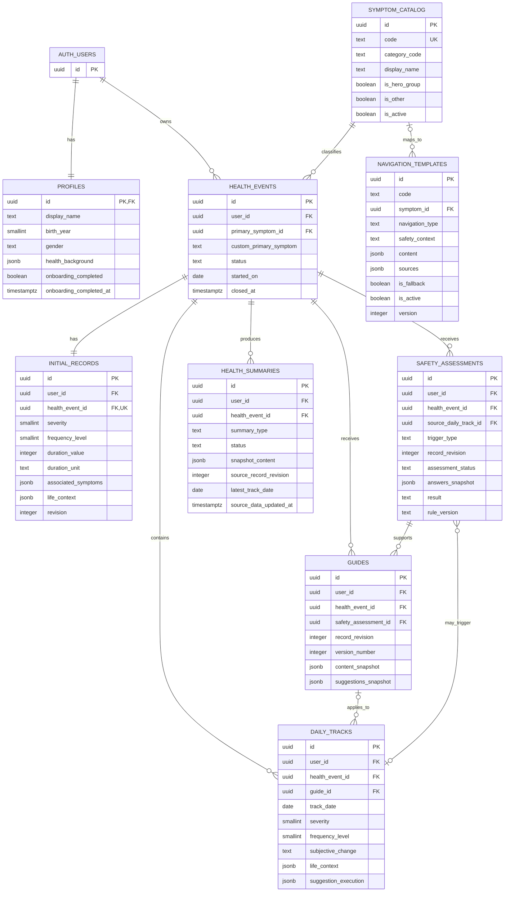

# NexNav MVP — Entity Relationship Diagram

**Version:** v1.0  
**Status:** Locked for Day 2 MVP Development  
**Source:** `03_Database_Schema.md v1.0`  
**Scope:** P0 Golden Path

---

## 1. Purpose

This document provides the implementation-facing Entity Relationship view of the NexNav P0 database. Field definitions, constraints, RLS, lifecycle rules, derived logic, and transaction boundaries remain governed by `03_Database_Schema.md v1.0`.

## 2. ER Diagram

## 3. Cardinality Summary

| Parent | Child | Cardinality | Meaning |
|---|---|---|---|
| Auth User | Profile | 1:1 | Auth creation automatically creates one Profile |
| Auth User | Health Event | 1:N | A user may own multiple active and closed Events |
| Symptom Catalog | Health Event | 1:N | Each Event has one immutable Primary Symptom |
| Health Event | Initial Record | 1:1 | Each Event has exactly one editable baseline |
| Health Event | Safety Assessment | 1:N | Each Check/Recheck attempt is retained |
| Health Event | Guide | 1:N | Each refresh creates a new Guide version |
| Health Event | Daily Track | 1:N | Maximum one Track per Event per local day |
| Health Event | Health Summary | 1:N | Multiple historical ready snapshots are allowed |
| Guide | Daily Track | 1:N optional | Priority route may Track without a Guide |
| Daily Track | Safety Assessment | 1:N optional | A Track may trigger Recheck attempts |
| Symptom Catalog | Navigation Template | 1:N optional | Generic fallback may have no symptom |

## 4. Ownership Boundary

User-owned private tables:

- `profiles`
- `health_events`
- `initial_records`
- `safety_assessments`
- `guides`
- `daily_tracks`
- `health_summaries`

System-owned reference tables:

- `symptom_catalog`
- `navigation_templates`

Every private child row stores `user_id` and must match the owner of its referenced Health Event. Supabase RLS additionally requires `auth.uid()` to match that owner.

## 5. Lifecycle Rules

- Closing a Health Event preserves all child data.
- Primary Symptom, custom `Other` description, and Event start date are immutable.
- Initial Record content updates increment `revision` and invalidate older current Safety/Guide assumptions without deleting them.
- Safety and Guide history is append-oriented.
- Today’s Daily Track is editable; historical Tracks are read-only in P0.
- Ready Health Summaries are immutable snapshots.
- Reassess, Timeline, Current Safety, Current Guide, and Summary freshness are derived, not separate tables.

